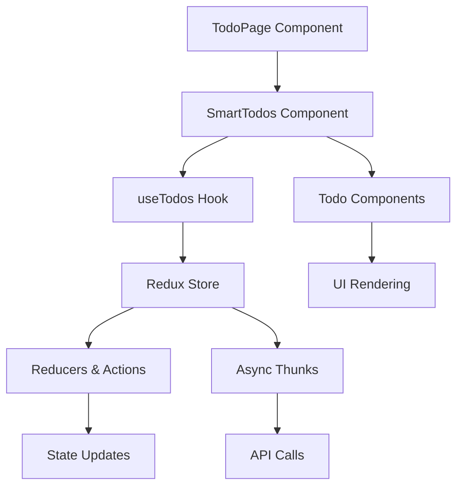

# Clean React

A clean and modular React project using Vite, Redux Toolkit, React Router, and
TypeScript.

## Project Overview



## Features

- **State Management**: Powered by Redux Toolkit.
- **Routing**: Handled by React Router.
- **Type Safety**: Fully typed with TypeScript.
- **Async Data Fetching**: Using Redux Thunks.
- **Component Composition**: Modular and reusable components.

## Setup Instructions

1. Clone the repository:

    ```bash
    git clone https://github.com/bensimmers/clean-react.git
    cd clean-react
    ```

2. Install dependencies:

    ```bash
    npm install
    ```

3. Start the development server:

    ```bash
    npm run dev
    ```

4. Build the project for production:

    ```bash
    npm run build
    ```

5. Preview the production build:
    ```bash
    npm run preview
    ```

## Deployment

This project is deployed using GitHub Pages. The deployment workflow is defined
in `.github/workflows/deploy.yaml`. To deploy:

1. Push changes to the `main` branch.
2. The GitHub Actions workflow will automatically build and deploy the project
   to GitHub Pages.
3. Access the deployed app at:
   [https://bensimmers.github.io/clean-react/](https://bensimmers.github.io/clean-react/)

## Folder Structure

```
clean-react/
├── src/
│   ├── components/         # Shared UI components
│   ├── lib/                # Utilities, hooks, and store
│   ├── pages/              # Page-level components
│   ├── services/           # Features (e.g., todos)
│   ├── App.tsx             # Main app component
│   ├── main.tsx            # Entry point
│   └── index.css           # Global styles
├── public/                 # Static assets
├── .github/workflows/      # GitHub Actions workflows
├── package.json            # Project metadata and scripts
├── vite.config.ts          # Vite configuration
└── README.md               # Project documentation
```

## Scripts

- `npm run dev`: Start the development server.
- `npm run build`: Build the project for production.
- `npm run preview`: Preview the production build.
- `npm run lint`: Lint the codebase using ESLint.
